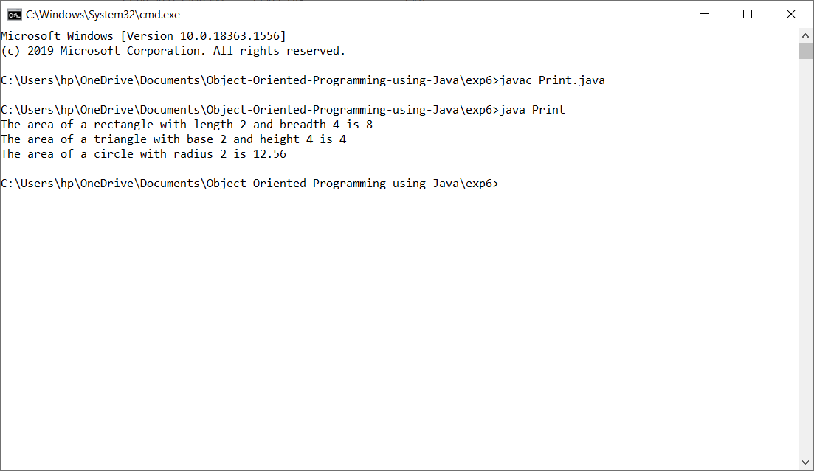

# Object Orientd Programming Laboratory using Java
##### Anna University R2017 - CS8383
###### Built on Java Version 1.8.0_181
## Table of Contents
1. [Development of a Java application to generate electricity bill.](#1-ELECTRICITY-BILL-GENERATION)
2. [Development of a Java application to implement distance, currency and time converter using Packages](#2-CONVERTOR-PACKAGE)
3. [Development of a Java application to generate pay slips for the employees with their gross and net salary.](#3-PAY-SLIP-GENERATION)
4. [Design of a Java interface for ADT Stack and to implement this interface using array.](#4-ABSTRACT-DATA-TYPE-STACK-USING-ARRAY)
5. [Development of a Java program to perform string operations using ArrayList.](#5-STRING-OPERATIONS-USING-ARRAY-LIST)
6. [Implementation of an Abstract class](#6-ABSTRACT-CLASS)
7. [Implementation of user-defined exception handling](#7-USER-DEFINED-EXCEPTION-HANDLING)
8. [Implementation of file operations in Java](#8-FILE-OPERATIONS)
9. [Implementation of multithreading](#9-MULTITHREADING)
10. [Development of a Java program to find the maximum value from the given type of elements using a generic function.](#10-GENERIC-FUNCTION)
11. [To design a calculator using event-driven programming paradigm of Java with decimal and scientific manipulations](#11-CALCULATOR-APP)
12. [Acknowledgement](#12-ACKNOWLEDGEMENT)

## 1. ELECTRICITY BILL GENERATION
- Create a class with the following members: Consumer no, consumer name, previous month reading, current month reading,
type of EB connection (i.e domestic or commercial). 
- Compute the bill amount using the following tariff: 
...-If the type of the EB connection is domestic, calculate the amount to be paid as follows: 
......-First 100 units - Rs. 1 per unit 
......-101-200 units - Rs. 2.50 per unit 
......-201 -500 units - Rs. 4 per unit 
......-501 units - Rs. 6 per unit 
...-If the type of the EB connection is commercial, calculate the amount to be paid as follows:
......-First 100 units - Rs. 2 per unit 
......-101-200 units - Rs. 4.50 per unit 
......-201 -500 units - Rs. 6 per unit 
......-> 501 units - Rs. 7 per unit

## 2. CONVERTOR PACKAGE
- Convert meter to kilometer and kilometer to meter using the formula 1km=1000m
- Convert mile to kilometer and kilometer to mile using the formula 1 mile = 1.6km
- Convert dollar to INR and INR to dollar using the formul 1 INR=68.77 dollars
- Convert euro to INR and INR to euro using the formula 1 INR=80.62 euros
- COnvert yen to INR and INR to en using the formula 1 yen = 0.62 INR
- Convert hours to minutes and mintutes to hours using the formula 1 hour = 60 minutes
- Convert hours to seconds and seconds to hours using the formula 1 hour = 3600 seconds
- Convert seconds to minutes and minutes to seconds using the formula 1 minute = 60 seconds
- Import the convertor package and according to the number entered perform distance, currenecy and time conversion

## 3. PAY SLIP GENERATION
- Get the employee details in the input function
- Create classes programmer, associate professor, assistant professor and professor extending the employee class
- In the get method of the class, get the value of basic pay
- Calculate gross salary by adding da, hra and pf calculated using the basic pay
- Calculate net salary by adding da, hra, pf and scf calculated using the basic pay
- Get the number of employees and their profession in the main class

## 4. ABSTRACT DATA TYPE STACK USING ARRAY
- Set index = 1 and n=0
- push method adds maximum of 5 elements to the array
- pop method removes an element from the array by decreasing n
- display method prints the elements in the array
- The user enters 1,2 or 3 to call the push, pop or display method

## 5. STRING OPERATIONS USING ARRAY LIST
- Get the number of strings to be inserted into the array
- Get each string and add it to the array
- Create an object that calls the disp function in the Display class, which displays all the strings in the array.
- Create an object that calls the add_at_end function in the Add class, which adds the input string to the end of the array.
- Create an object that calls the append function in the Insert class, which adds the input string at the specified position.
- Create an object that calls the search function in the Find class, which searches for a given string and returns the position in the array if it is present, else returns that the string is absent.
- Create an object that calls the cmp function in the Compare class that returns all strings that start with the input letter specified.

## 6. ABSTRACT CLASS
- Create an abstract class Shape and initialize two variables and declare method printArea().
- Create subclasses Rectangle, Triangle and Circle to compute the area in the printArea method using the variables initialized in the abstract class.
- Create objects for the subclasses in the main method of the Print class and call printArea() using the objects.

## 7. USER DEFINED EXCEPTION HANDLING
- Create class my_exception that extends the Exception class
- In the my_exception method that takes as argument str2, assign str2 to str1
- Return My exception occured appended with str1 in the toString() method.
- In the try block of the main method, throw the object of the my_exception method and set str2 as This is my error message
- Catch my_exception in an object and print it

## 8. FILE OPERATIONS
- Get the name of the file and store it in the File object.
- If the file exists, print exists, else print that it does not.
- If f.canRead() returns true, print Can read else print Cannot read file.
- If f.canWrite() returns true, print can rite, else print cannot write file
- Print the length of the file using f.length()

## 9. MULTITHREADING
- Get the number of random numbers to be generated and generate random numbers between 1 and 100 using the Random method.
- Create 3 thread classes implementing Runnable interface.
- A random number is generated every one second by the first thread and is stored as n.
- If the random number is even, the number and the square of the number is printed by the second thread.
- If the random number is odd, the number and the cube of the number is printed by the third thread.

## 10. GENERIC FUNCTION
- Create class gen where and pass arguments of type T to the max function where T extends Comparable class.
- Check if a is greater than b using the compareTo method and print the maximum of a and b.
- In the main method, call the max function and pass any data type as argument.

